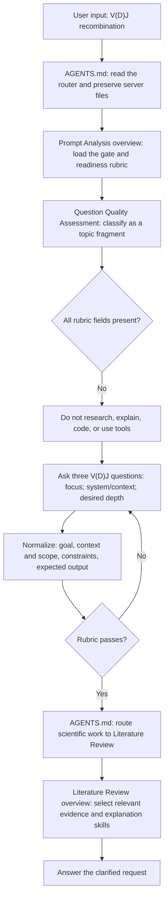

# V(D)J Topic-Fragment Flow

Relevant files: `AGENTS.md`, `overview.md`, `workflow.md`, `skills/prompt-readiness-rubric.md`, `skills/question-quality-assessment.md`, `skills/clarification-and-normalization.md`, and `../literature-review/overview.md`.
